# 🚨 NirbhayX  
**Tap Fearlessly. Live NirbhayX.**

[]()  
[]()  
[]()

---

## 📖 Project Description
NirbhayX is a **modern personal safety application** designed to keep users secure and connected during emergencies.  
It enables **instant SOS alerts via power button**, **real-time location sharing**, **background audio/video recording**, **offline SMS alerts**, and **fake call escape tools** — all in a **bold, user-friendly Android app**.  

> [!IMPORTANT]
> Even without internet, your emergency contacts will receive SMS alerts using stored contact data from the local Room Database.

---

## 📸 Screenshots

### **Core Features**
| Home Screen | SOS Trigger / Notifications | Profile |
|-------------|-----------------------------|---------|
| 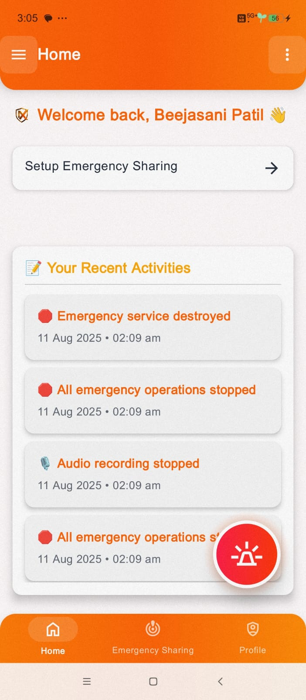 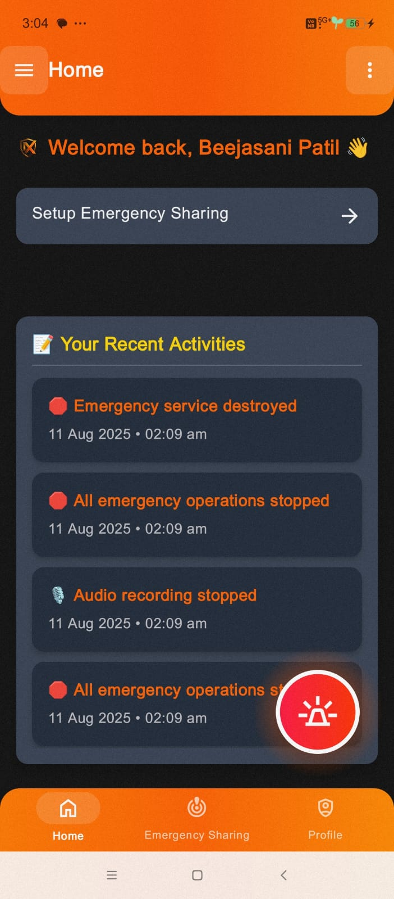 | 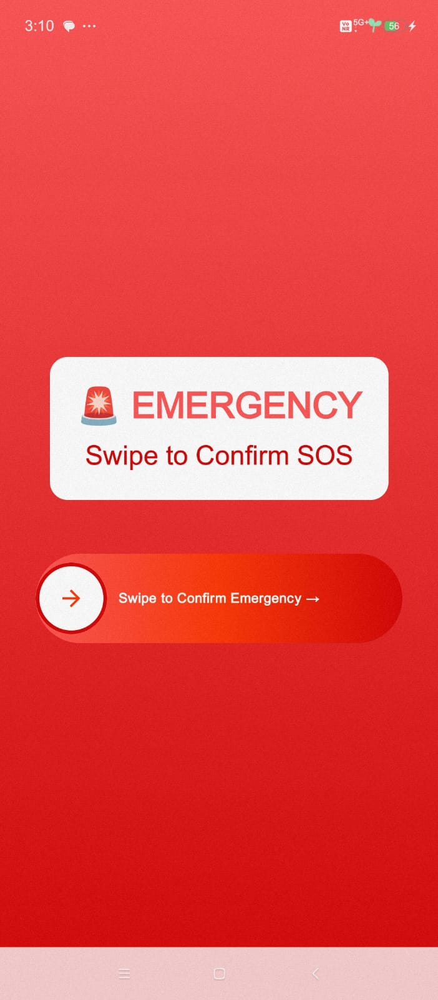 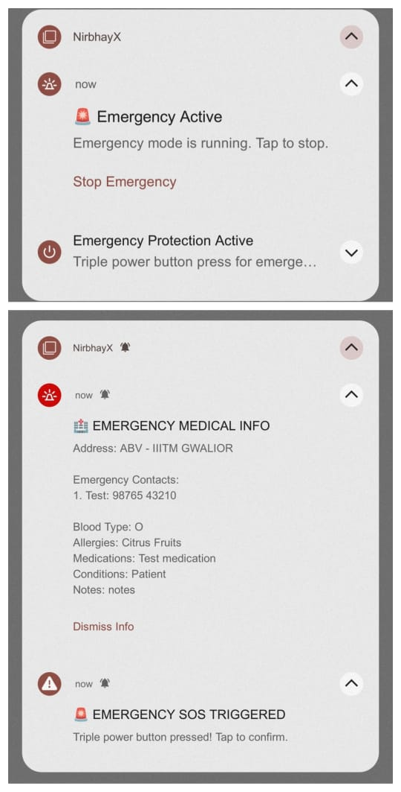 | 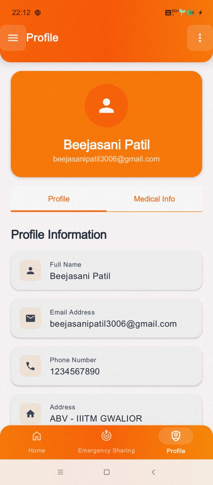 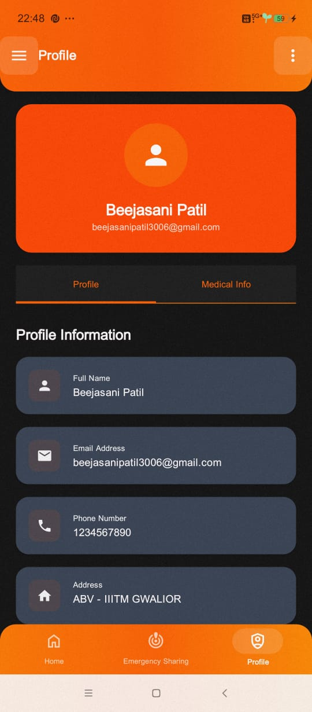 |

| Emergency Sharing | Emergency Contacts | Medical Info |
|-------------------|--------------------|--------------|
| 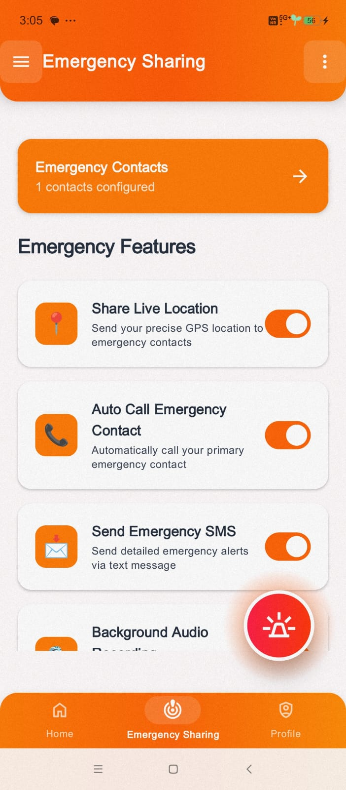 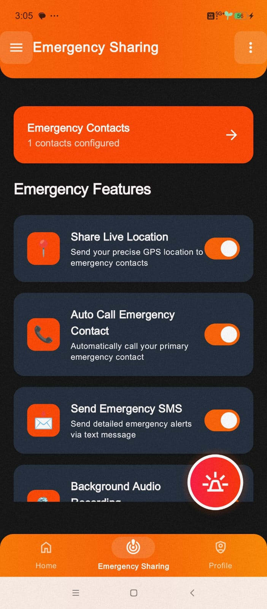 | 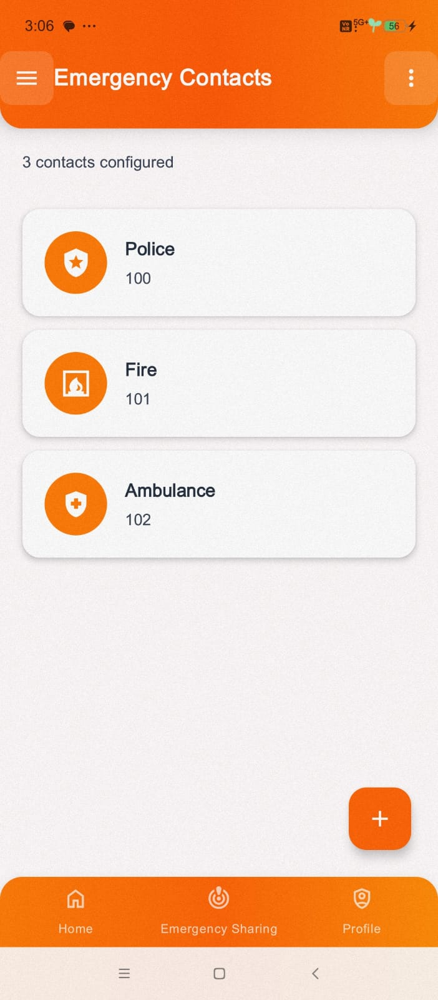 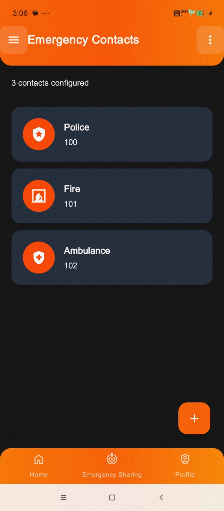 | 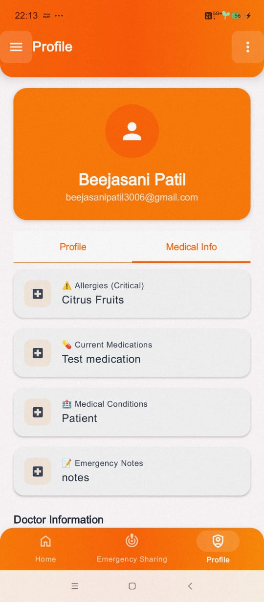 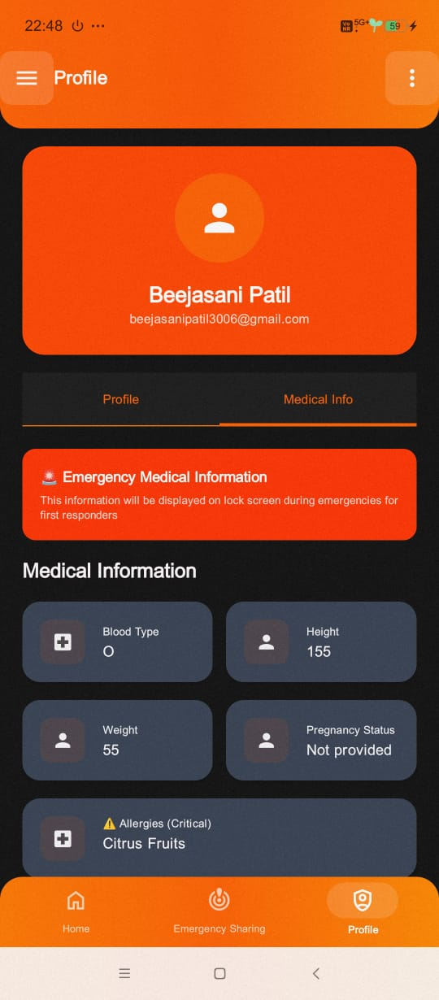 |

---

### **Additional Features**
| Safety Tips | Fake Call | Widgets / Lock Screen Notifications |
|-------------|-----------|--------------------------------------|
| 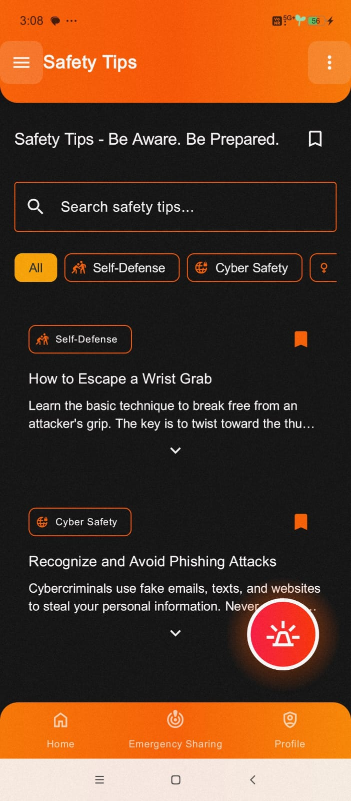  | 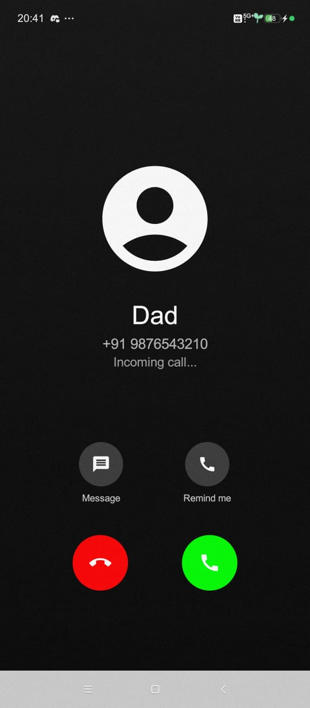 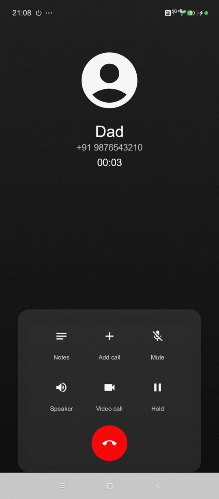 | 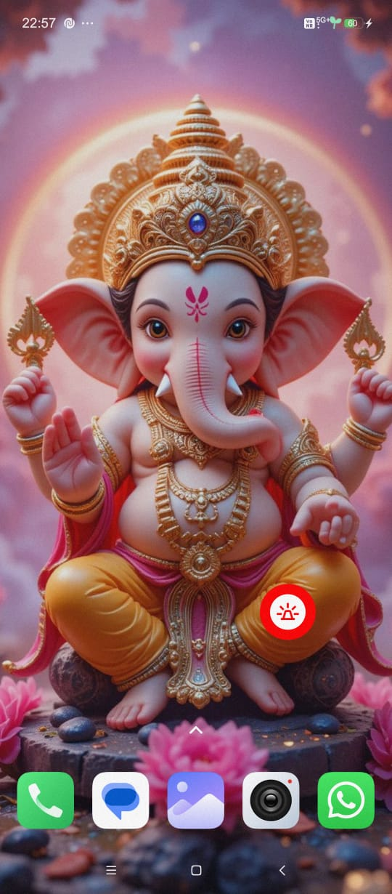  |

| Community Safety Hub *(UI done, backend planned)* | Settings | About | Help |
|---------------------------------------------------|----------|-------|------|
| 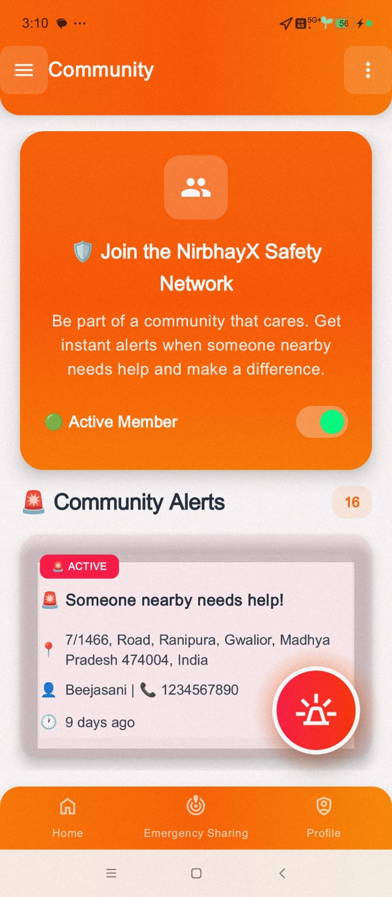 | 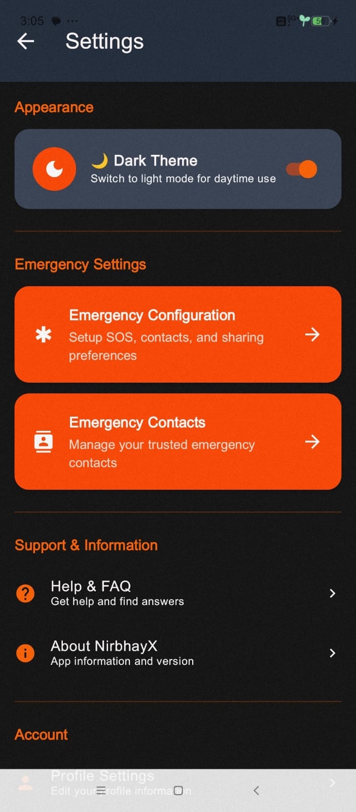 | 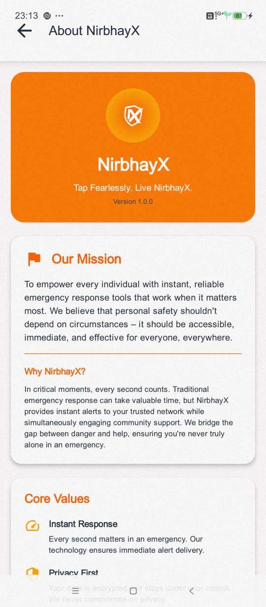 | 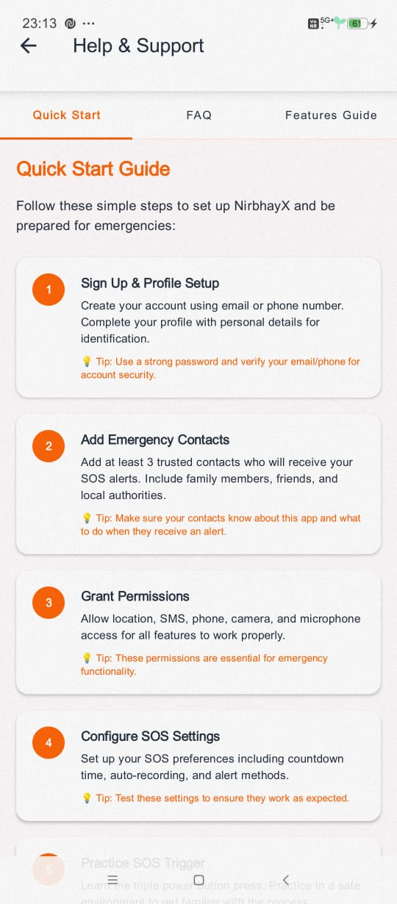 |

---

### **Auth & Branding**
| Login | App Logo | SignUp                                                |
|-------|----------|-------------------------------------------------------|
| 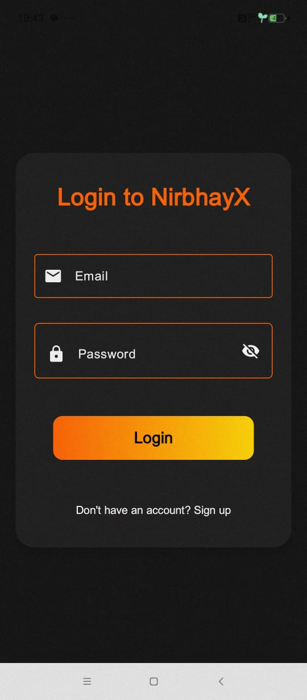 | 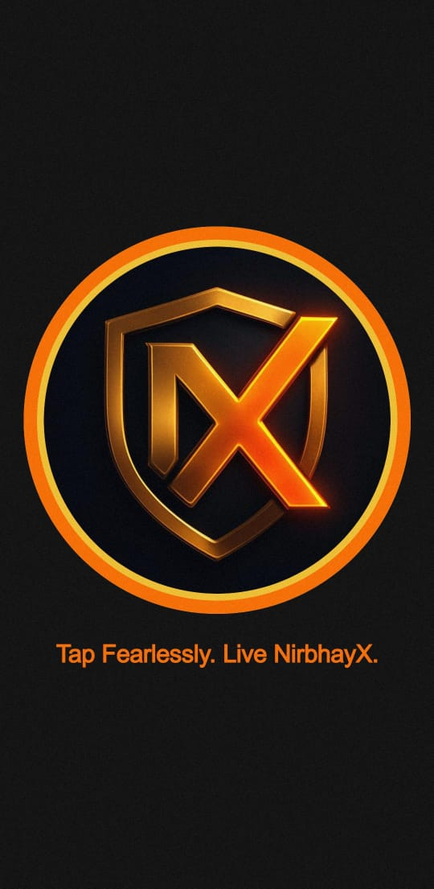 | 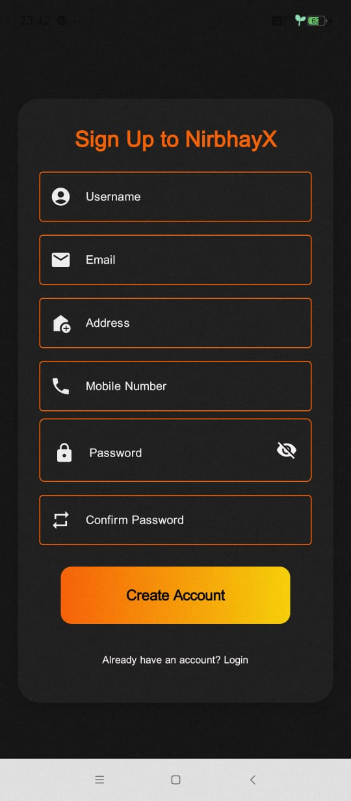 | 

---

## 🌐 Hosted URL
Not hosted — distributed as **APK installation**.
[📥 Download NirbhayX APK from Google Drive](https://drive.google.com/file/d/1q8-bdyoa6VkzULgO9xhv5InC396IB3Ym/view?usp=sharing)


---

## ✅ Features Implemented

### **Frontend**
- 🎨 Modern UI with **Jetpack Compose** & Material 3
- 🌗 **Light/Dark theme switching**
- 🧭 Persistent navigation (Drawer + Bottom Navigation + Modal Sheet)
- 🛡 UI ready for **Community Safety Hub** *(backend integration planned)*
- 📌 **App Widget** & **Lock Screen Notifications**
- 📞 **Fake Call Feature** with customizable caller ID & timer
- 🌏 Multilingual support *(planned)*

### **Backend**
- 🔐 Secure Authentication & profile management (**Firebase Auth**)
- 🚨 **Prominent SOS Button** for instant alerts
- 📍 **Real-Time Location Sharing** with pre-set contacts
- 🎥 **Background Audio/Video Recording** on SOS trigger
- ☁ **Firebase Firestore** for cloud data
- 💾 **Room Database** for offline storage of contacts/logs
- 📂 **Firebase Storage** for media storage
- 📜 Detailed **Activity Logs** for all alerts & actions
- 🚑 **Medical Information** Storage & Display on Lock Screen (blood type, allergies, emergency contacts — accessible during emergencies)

---

## 🛠️ Tech Stack
- **Language**: Kotlin  
- **UI**: Jetpack Compose, Material 3  
- **Architecture**: MVVM  
- **Database**: Room Database, Firebase Firestore  
- **Backend Services**: Firebase Auth, Firebase Storage  
- **Others**: OneSignal SDK, Google Play Services Location  

---

## ⚙️ Local Setup

### **Prerequisites**
- Android Studio **Giraffe+**
- Java 17+
- Firebase Project setup

### **Steps**
1. Clone the repo:
   ```bash
   git clone https://github.com/your-username/nirbhayx.git

### Steps to Setup the Project Locally
1. Open the project in **Android Studio**.
2. Place `google-services.json` in the `/app` folder.
3. Sync **Gradle**.
4. Build and run on an Android device or emulator (**Min SDK 21**).
5. *(Optional)* To test **SMS alerts offline** — grant **SMS** & **CALL** permissions on the device and add emergency contacts in-app.

---

## Team Member
- **Beejasani S. Patil** *(Solo Developer — Android & Backend)*

---

## 🎥 Demo Video
[](https://drive.google.com/file/d/10afTYZRNaFWXbQPCK02xNDOycP5-v7DV/view?usp=drive_link)


